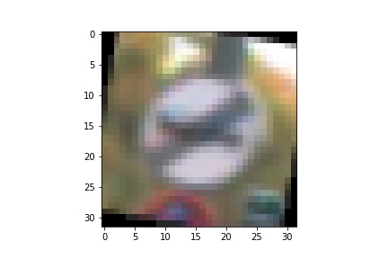

# **Traffic Sign Recognition**

## Writeup

### You can use this file as a template for your writeup if you want to submit it as a markdown file, but feel free to use some other method and submit a pdf if you prefer.

---

**Build a Traffic Sign Recognition Project**

The goals / steps of this project are the following:
* Load the data set (see below for links to the project data set)
* Explore, summarize and visualize the data set
* Design, train and test a model architecture
* Use the model to make predictions on new images
* Analyze the softmax probabilities of the new images
* Summarize the results with a written report

[//]: # (Image References)

[image1]: ./examples/visualization.jpg "Visualization"
[image2]: ./examples/grayscale.jpg "Grayscaling"
[image3]: ./examples/random_noise.jpg "Random Noise"
[image4]: ./examples/placeholder.png "Traffic Sign 1"
[image5]: ./examples/placeholder.png "Traffic Sign 2"
[image6]: ./examples/placeholder.png "Traffic Sign 3"
[image7]: ./examples/placeholder.png "Traffic Sign 4"
[image8]: ./examples/placeholder.png "Traffic Sign 5"

## Rubric Points
### Here I will consider the [rubric points](https://review.udacity.com/#!/rubrics/481/view) individually and describe how I addressed each point in my implementation.  

---
### Writeup / README

#### 1. Provide a Writeup / README that includes all the rubric points and how you addressed each one. You can submit your writeup as markdown or pdf. You can use this template as a guide for writing the report. The submission includes the project code.

You're reading it! and here is a link to my [project code](https://github.com/udacity/CarND-Traffic-Sign-Classifier-Project/blob/master/Traffic_Sign_Classifier.ipynb)

### Data Set Summary & Exploration

#### 1. Provide a basic summary of the data set. In the code, the analysis should be done using python, numpy and/or pandas methods rather than hardcoding results manually.

I used the pandas library to calculate summary statistics of the traffic
signs data set:

* The size of training set is 34799
* The size of the validation set is 4410
* The size of test set is 12630
* The shape of a traffic sign image is (32, 32, 3)
* The number of unique classes/labels in the data set is 43

#### 2. Include an exploratory visualization of the dataset.

Here is an exploratory visualization of the data set. It is a bar chart showing how the amount of data in each data set (training, validation, testing) compares to each other

### Design and Test a Model Architecture

#### 1. Describe how you preprocessed the image data. What techniques were chosen and why did you choose these techniques? Consider including images showing the output of each preprocessing technique. Pre-processing refers to techniques such as converting to grayscale, normalization, etc. (OPTIONAL: As described in the "Stand Out Suggestions" part of the rubric, if you generated additional data for training, describe why you decided to generate additional data, how you generated the data, and provide example images of the additional data. Then describe the characteristics of the augmented training set like number of images in the set, number of images for each class, etc.)

As a first step, I decided to augement the data by adding rotated images to any class that had less than 750 images. I wrote a function that copied all the images in that class and rotated them between +/-10 and +/- 20 degrees.

I decided to generate additional data because more data means better results when training a neural network, and the rotated images provide variations on that help promote feature learning over simple memorization.

Here is an example of a traffic sign image before and after rotation.

As a last step, I converted the images to grayscale and normalized the image data because it reduces the variance between images, which allows the neural network to look at variations between images that are important instead of variations caused by slight differences in color and intensity.

To add more data to the the data set, I used the following techniques because ...

Here is an example of an original image and an augmented image:

#### 2. Describe what your final model architecture looks like including model type, layers, layer sizes, connectivity, etc.) Consider including a diagram and/or table describing the final model.

My final model consisted of the following layers:

| Layer         		| Description	        						|
|:---------------------:|:---------------------------------------------:|
| Input         		| 32x32x1 Grayscale image   					|
| Convolution 1x1     	| 1x1 stride, valid padding, outputs 32x32x8 	|
| RELU					|												|
| Convolution 5x5     	| 1x1 stride, valid padding, outputs 28x28x16 	|
| RELU					|												|
| Max pooling	      	| 2x2 stride,  outputs 14x14x64 				|
| Convolution 5x5     	| 1x1 stride, valid padding, outputs 10x10x32 	|
| RELU					|												|
| Max pooling	      	| 2x2 stride,  outputs 5x5x32 					|
| Flatten				| Input 5x5x32, outputs 800						|
| Fully connected		| Input 800, outputs 240						|
| RELU					|												|
| Dropout				| Keep prob: 65%								|
| Fully connected		| Input 240, outputs 168						|
| RELU					|												|
| Dropout				| Keep prob: 65%								|
| Fully connected		| Input 168, outputs 43							|
| RELU					|												|
| Dropout				| Keep prob: 65%								|
| Softmax				|												|
| Cross entropy			|												|
|						|												|
|						|												|

#### 3. Describe how you trained your model. The discussion can include the type of optimizer, the batch size, number of epochs and any hyperparameters such as learning rate.

To train the model, I pretty much followed the LeNet training pipeline used in the lab, which included the Adam optimizer.

My hyper-parameters were
EPOCHS: 		25
BATCH SIZE: 	64
LEARNING RATE: 	0.001
KEEP PROB: 		0.65

#### 4. Describe the approach taken for finding a solution and getting the validation set accuracy to be at least 0.93. Include in the discussion the results on the training, validation and test sets and where in the code these were calculated. Your approach may have been an iterative process, in which case, outline the steps you took to get to the final solution and why you chose those steps. Perhaps your solution involved an already well known implementation or architecture. In this case, discuss why you think the architecture is suitable for the current problem.

My final model results were:
* training set accuracy of 0.826
* validation set accuracy of 0.941
* test set accuracy of 0.921

If an iterative approach was chosen:
* What was the first architecture that was tried and why was it chosen?
* What were some problems with the initial architecture?
* How was the architecture adjusted and why was it adjusted? Typical adjustments could include choosing a different model architecture, adding or taking away layers (pooling, dropout, convolution, etc), using an activation function or changing the activation function. One common justification for adjusting an architecture would be due to overfitting or underfitting. A high accuracy on the training set but low accuracy on the validation set indicates over fitting; a low accuracy on both sets indicates under fitting.
* Which parameters were tuned? How were they adjusted and why?
* What are some of the important design choices and why were they chosen? For example, why might a convolution layer work well with this problem? How might a dropout layer help with creating a successful model?

If a well known architecture was chosen:
* What architecture was chosen?
* Why did you believe it would be relevant to the traffic sign application?
* How does the final model's accuracy on the training, validation and test set provide evidence that the model is working well?

I settled on the LeNet architecture used in the previous lab because this is my first time using neural networks and I thought
it would be a good start. However, it did not perform as well on the traffic signs as it did on the MNIST numbers dataset, so I
had to play around with it.

I began by simply changing the number of epochs and the batch size, increasing the number of epochs to 25 and decreasing the batch size to 64, but that only got me so far. I then moved on to adding dropout, but since I think my model has the tendency to underfit instead of overfit this didn't have that big of an impact.

I think the biggest improvement came when I added an extra convolutional 1x1 layer, which I did after reading some forum posts about how a 1x1 convolutional layer can be used as a feature extractor.

That being said, each change only had a small impact on the performance of the model, but by combining them all I was able to improve the performance by about 10%. I think it could be a little higher using this same or a similar architecture, but I'm guessing that it would take an overhaul of the architecture to improve it more than a percent or two. Unfortunately, I don't know quite enough about machine learning and neural networks to implement that just yet, but perhaps I'll come back to it when I learn more.

### Test a Model on New Images

#### 1. Choose five German traffic signs found on the web and provide them in the report. For each image, discuss what quality or qualities might be difficult to classify.

Here are six German traffic signs that I found on the web:

  
  

#### 2. Discuss the model's predictions on these new traffic signs and compare the results to predicting on the test set. At a minimum, discuss what the predictions were, the accuracy on these new predictions, and compare the accuracy to the accuracy on the test set (OPTIONAL: Discuss the results in more detail as described in the "Stand Out Suggestions" part of the rubric).

Here are the results of the prediction:

| Image			        |     Prediction	        					|
|:---------------------:|:---------------------------------------------:|
| 70 km/h 				| General caution   							|
| Right turn     		| Right of way at next intersection 			|
| No enter				| No enter										|
| 50 km/h	      		| 50 km/h						 				|
| Left turn     		| 50 km/h      									|
| Stop					| Stop      									|

The model was able to correctly guess 3 of the 4 traffic signs, which gives an accuracy of 50%. This does not compare favorably to the accuracy on the test set of 92.1%. This is most likely due to the small number of images, but it also could be because some of the test data probably bled back into the training process and caused some memorization to happen.

#### 3. Describe how certain the model is when predicting on each of the five new images by looking at the softmax probabilities for each prediction. Provide the top 5 softmax probabilities for each image along with the sign type of each probability. (OPTIONAL: as described in the "Stand Out Suggestions" part of the rubric, visualizations can also be provided such as bar charts)

The code for making predictions on my final model is located in the 15th cell of the Ipython notebook.

For the first image, the model is somewhat unsure that this is a general caution sign (probability of 0.59), but the image contains a 70 km/h speed limit sign which was the second highest guess (probability of 0.41). The top three soft max probabilities were

| Probability         	| Prediction	        						|
|:---------------------:|:---------------------------------------------:|
| .59         			| General caution   							|
| .41     				| 70 km/h 										|
| .00					| Stop											|

For the second image, it was almost positive the sign was a right of way sign (probability of 98%), and the correct guess didn't even show up in the top 3.

| Probability         	| Prediction	        						|
|:---------------------:|:---------------------------------------------:|
| .98         			| Right of way   								|
| .02     				| Vehicles over 3.5 tons prohibited 			|
| .00					| Beware of ice/snow							|

Finally in the third image the image was correctly predicted to be a do not enter sign with a very high degree of confidence (probability of 100%)

| Probability         	| Prediction	        						|
|:---------------------:|:---------------------------------------------:|
| 1.0         			| No enter   									|
| .00     				| No passing 									|
| .00					| Stop											|

The remaining predictions are shown below.

50 km/h (Correct)
| Probability         	| Prediction	        						|
|:---------------------:|:---------------------------------------------:|
| 1.0         			| 50 km/h   									|
| .00     				| Stop 											|
| .00					| 20 km/h										|

Left turn (Incorrect)
| Probability         	| Prediction	        						|
|:---------------------:|:---------------------------------------------:|
| .98         			| 50 km/h   									|
| .02     				| Keep right 									|
| .00					| Yield											|

Stop (Correct)
| Probability         	| Prediction	        						|
|:---------------------:|:---------------------------------------------:|
| .99         			| Stop   										|
| .00     				| Keep left 									|
| .00					| Go straight or left							|

In each one (other than the first), the model was very confident in it's answers, even when they were incorrect. To me, this seems to show that the model either hasn't been trained enough and thus has not trained the right features, or it is overfitting.

### (Optional) Visualizing the Neural Network (See Step 4 of the Ipython notebook for more details)
#### 1. Discuss the visual output of your trained network's feature maps. What characteristics did the neural network use to make classifications?
